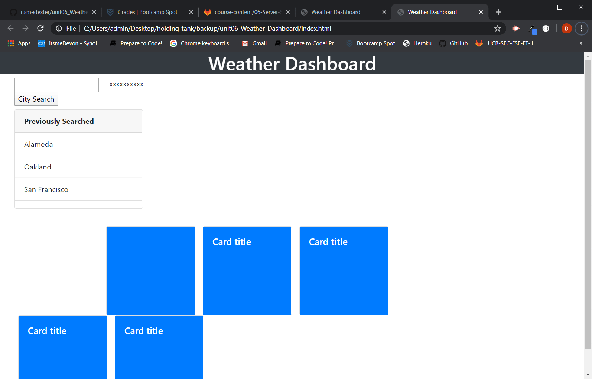

# Weather Dashboard

Updated with before and after screen shot.

Here is a Weather Dashboard created in Jquery. User inputs a "city" in the input field. When button clicked, current weather with five day forcast appears. 

# Questions that came about 

 At first, I couldn't do the icons correctly. Then searched and found another solution by downloading icons needed and use the right one when per weather API icon code.

### Prerequisites

Any web browser can access or view link, repository. Use source-code editor to view html javascript files. 

## Built With

* [HTML](https://developer.mozilla.org/en-US/docs/Web/HTML)
* [CSS](https://developer.mozilla.org/en-US/docs/Web/CSS)
* [Bootstrap] (https://stackpath.bootstrapcdn.com/bootstrap/4.3.1/css/bootstrap.min.css)
* [Jquery] (https://code.jquery.com/jquery-3.4.1.min.js)

## Deployed Link

* [See Live Site](https://itsmedexter.github.io/Weather_Dashboard/)

## Authors

Dexter Valencia 

- [Link to Portfolio Site](https://github.com/itsmedexter/unit06_Weather_Dashboard)
- [Link to Github](https://github.com/itsmedexter)
- [Link to LinkedIn](https://www.linkedin.com/in/dextervalencia/)

## License

This project is licensed under the MIT License 

## Acknowledgments

* Kerwin helped me a lot with this project. The tutor for showing new posibilities which seem unobtainable at the moment.  
